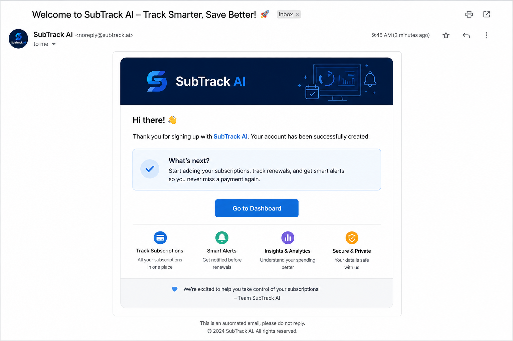
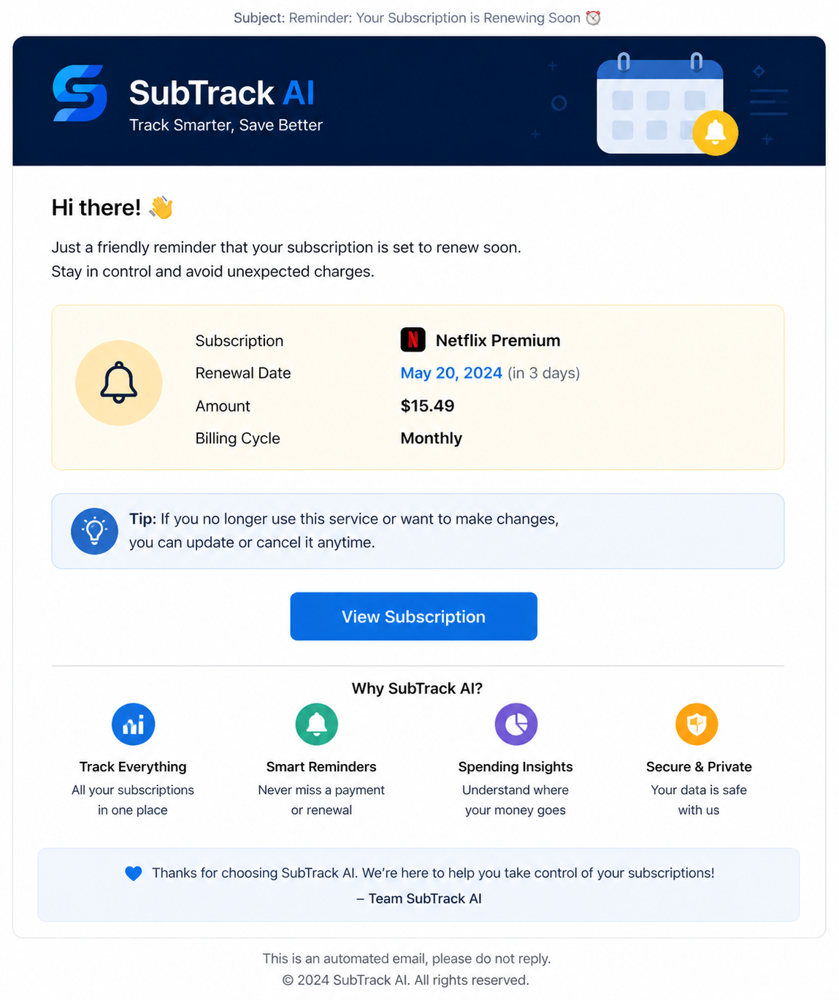

# SubTrack-AI

## Overview

SubTrack-AI is a microservices-based subscription tracking platform that combines Java Spring Boot backend services, a React Native mobile app, and a Python-powered LLM service. It helps users manage recurring subscriptions, receive notifications, and automatically convert natural language messages into structured subscription data.

## Key Features

- Subscription creation, editing, and management
- User authentication and profile handling
- Notification delivery for upcoming renewals
- Analytics dashboard for spending trends
- Mobile-first experience with React Native + Expo
- LLM-based input parsing for structured subscription data
- Microservices architecture with API gateway
- Docker Compose orchestration for local deployment

## Architecture

The system is built as a distributed application with dedicated services for authentication, user profiles, subscriptions, notifications, and LLM-driven message parsing.

### Architecture Diagrams

## Services

- `api-gateway/` - Central routing and request handling for all backend services.
- `auth-service/` - User authentication, JWT issuance, and access control.
- `user-service/` - User profile management, preferences, and account settings.
- `subscription-service/` - Subscription CRUD operations, billing cycles, and analytics.
- `notification-service/` - Notification scheduling and delivery for reminders.
- `llm-service/` - Natural language message parsing service that converts free-form user input into structured subscription data and publishes it to the subscription pipeline.
- `phone-app/` - React Native mobile application used by end users.

## Folder Structure

- `api-gateway/`
- `auth-service/`
- `notification-service/`
- `subscription-service/`
- `user-service/`
- `llm-service/`
- `phone-app/`
- `image/` - architecture diagrams and mobile screenshots
- `mysql/` - database initialization scripts

## Mobile App Screenshots

### Dashboard

### Add Subscription

### Subscription List

### Subscription Details

### Notifications

### Analytics

### Help Screen

### Profile Screen

## Email Notification Screenshots

These screenshots show the emails sent by the project, including the welcome email and reminder email.

## Getting Started

### Prerequisites

- Java 11 or later
- Maven
- Docker and Docker Compose
- Python 3.10 or later (for `llm-service`)
- Node.js and npm or yarn
- Expo CLI (for React Native app)

### Run Backend Services

1. Start the MySQL database using the schema in `mysql/init.sql`.
2. Start Java services from each service folder:
   - `auth-service`
   - `user-service`
   - `subscription-service`
   - `notification-service`
   - `api-gateway`
3. Start the LLM service if available:
   - `llm-service/` (Python-based message parser)

### Run Mobile App

1. Install dependencies in `phone-app/`:
   - `npm install` or `yarn install`
2. Launch the app with Expo:
   - `npx expo start`

## How the LLM Service Works

The `llm-service` listens for user messages, parses them into structured subscription objects, and publishes the parsed data to the subscription workflow. This enables users to create or update subscriptions using plain language input.

## Notes

- The API Gateway centralizes all client requests and routes them to the appropriate backend service.
- The LLM service provides intelligent message processing for automated subscription creation.
- The Notification service sends alerts based on subscription events and renewal dates.

## License

This repository does not include a license file. Add a license if required for your project.

