# SubTrack-AI

## Overview

SubTrack-AI is a subscription tracking and reminder system built as a microservices-based project. It helps users manage recurring subscriptions, receive notifications, and view analytics through a mobile application interface.

## Key Features

- Subscription creation and management
- User authentication and account handling
- Notification delivery for upcoming renewals
- Analytics dashboard for subscription expenses
- Mobile app experience with profile and subscription details
- Microservices architecture with API gateway

## Architecture

The project is designed as a distributed system with multiple backend services and a React Native mobile app.

### Architecture Diagrams

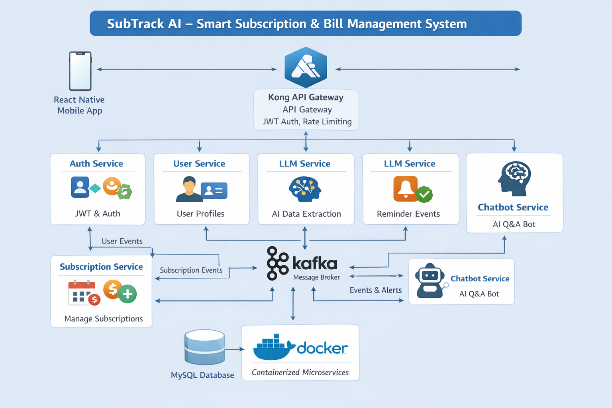

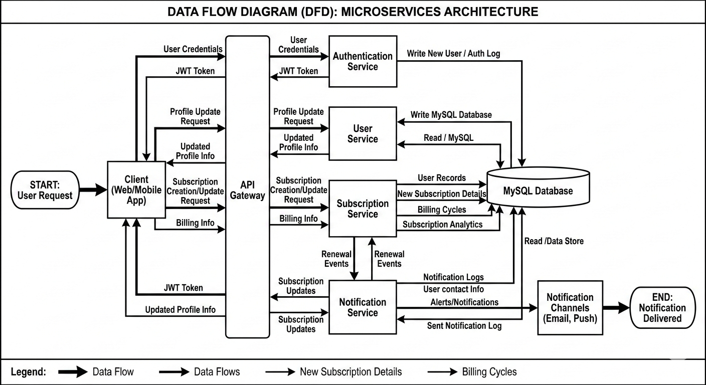

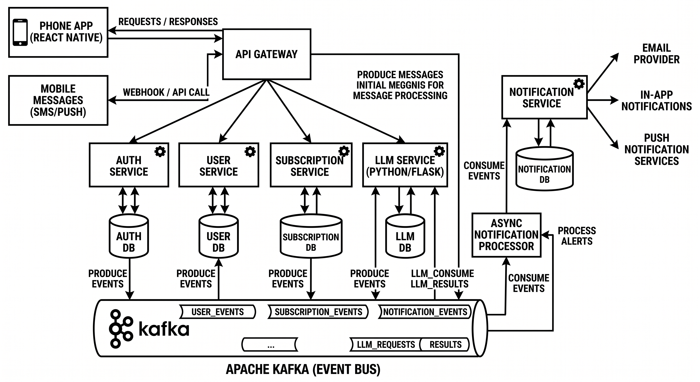

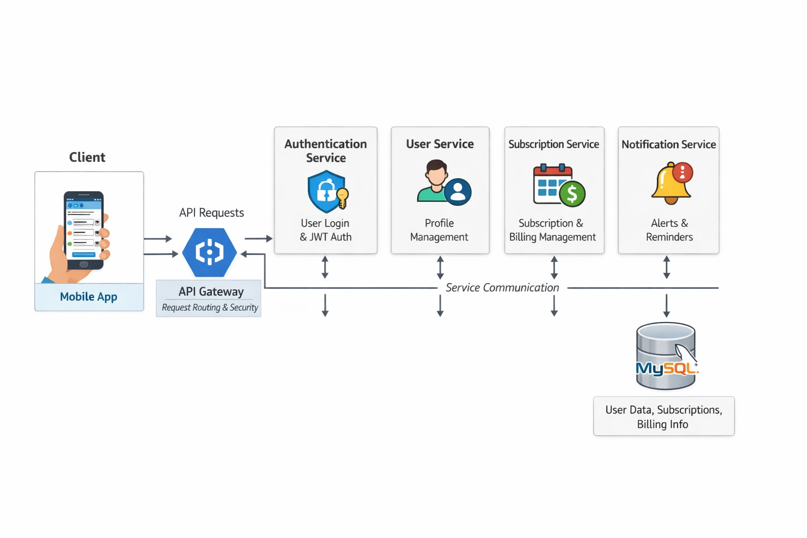

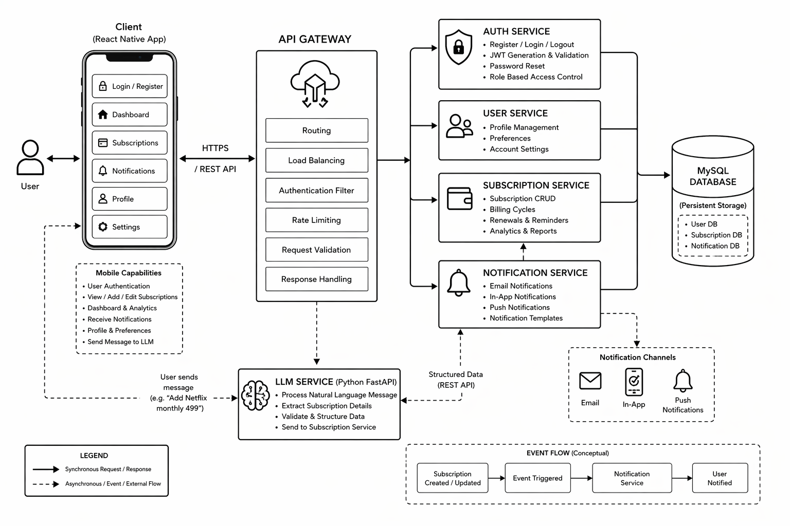

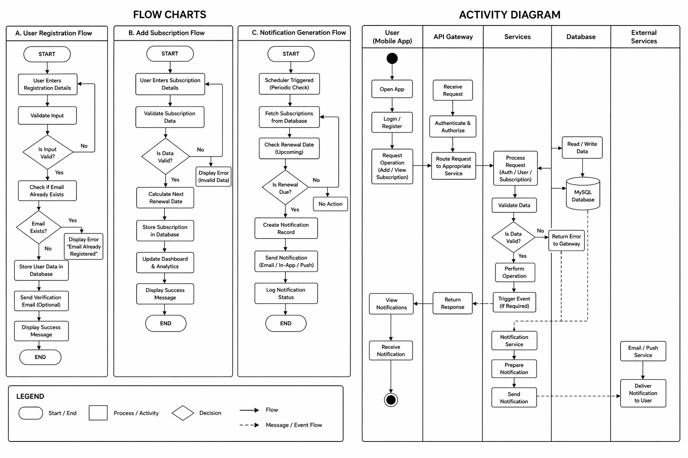

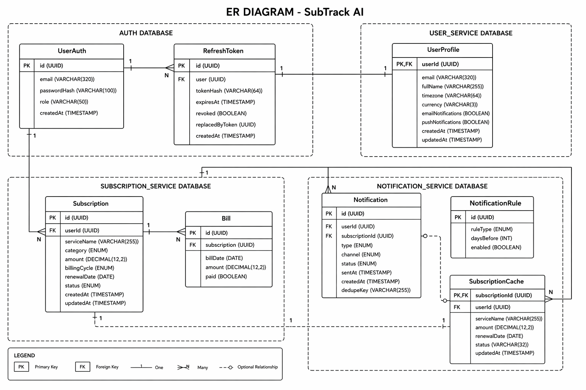

## Services

- `api-gateway/` - API gateway that routes requests to backend services and handles cross-service communication.
- `auth-service/` - Authentication and user management service.
- `user-service/` - User profile and account data service.
- `subscription-service/` - Subscription CRUD and management service.
- `notification-service/` - Notification delivery service for reminders and alerts.
- `phone-app/` - React Native mobile application for users.

## Folder Structure

- `api-gateway/`
- `auth-service/`
- `notification-service/`
- `subscription-service/`
- `user-service/`
- `phone-app/`
- `image/` - architecture diagrams and screenshots
- `mysql/` - database initialization scripts

## Mobile App Screenshots

### Dashboard

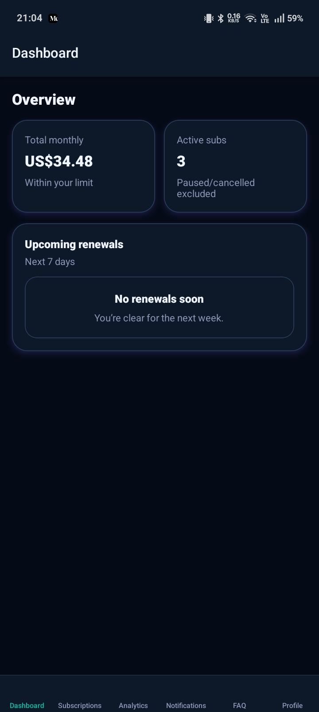

### Add Subscription

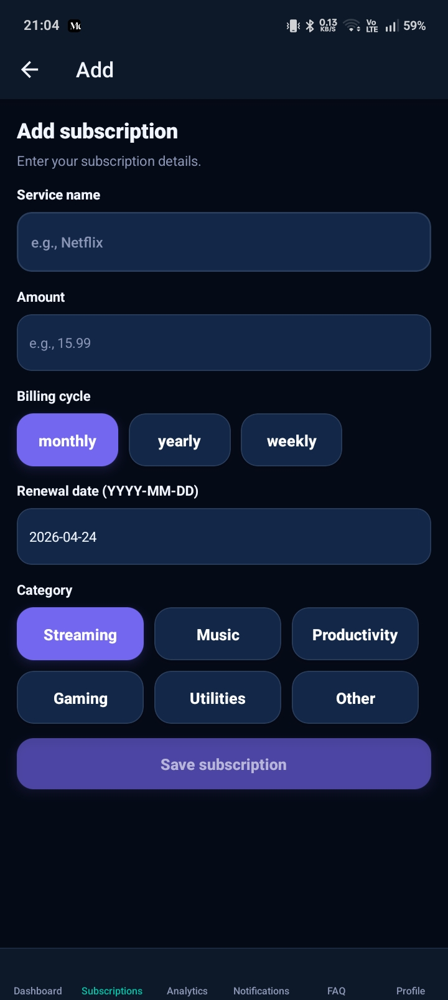

### Subscription List

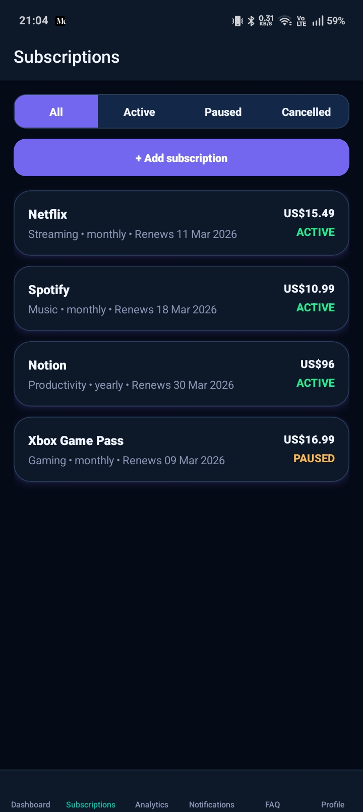

### Subscription Details

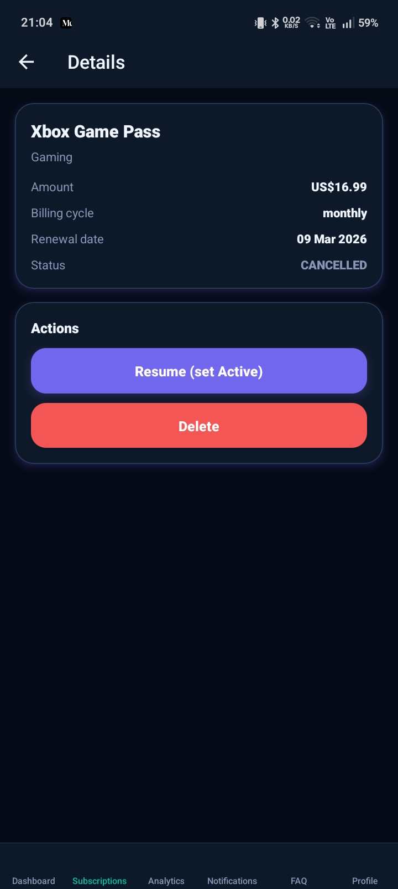

### Notifications

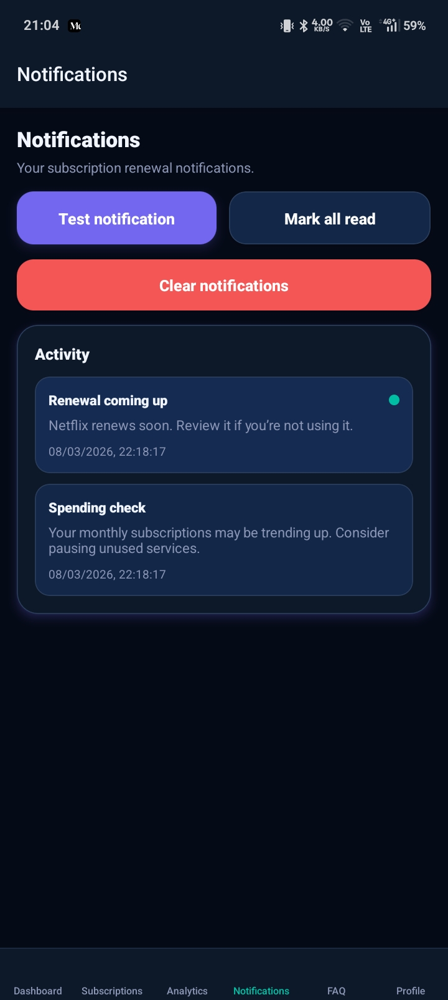

### Analytics

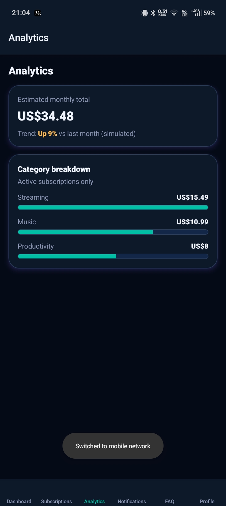

### Help Screen

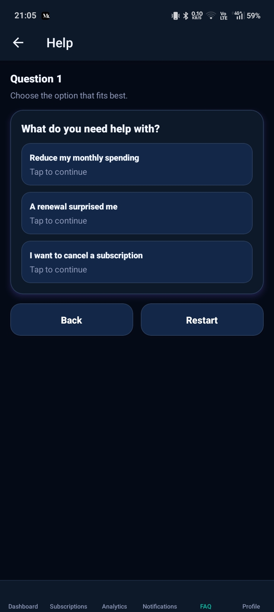

### Profile Screen

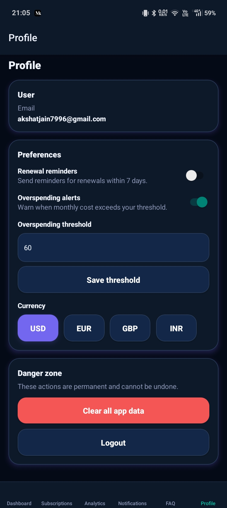

## Getting Started

### Prerequisites

- Java 11 or later
- Maven
- Docker and Docker Compose
- Node.js and npm or yarn
- Expo CLI (for React Native app)

### Run Backend Services

1. Start MySQL database using `mysql/init.sql`.
2. Build and run services with Maven inside each service folder:
   - `auth-service`
   - `user-service`
   - `subscription-service`
   - `notification-service`
   - `api-gateway`

### Run Mobile App

1. Install dependencies in `phone-app/`:
   - `npm install` or `yarn install`
2. Launch the app with Expo:
   - `npx expo start`

## Notes

- The app uses an API gateway to centralize routes and service discovery.
- The notification service is responsible for sending reminders about upcoming subscriptions.

## License

This repository does not include a license file. Add a license if required for your project.

